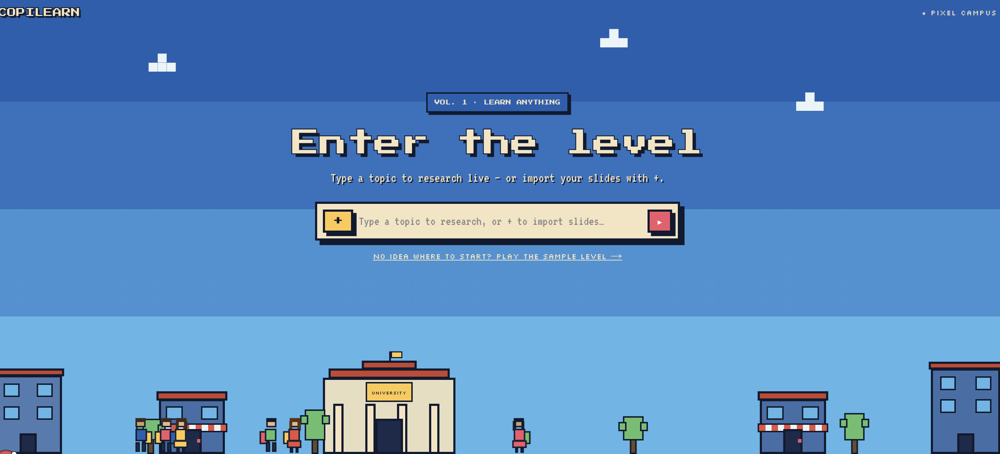

# Copilearn

**Drop in a lecture, get a learning level.** Copilearn is a generative-UI study
app: upload your course slides — or just type a topic — and an AI agent builds a
tailored, game-like learning environment on the spot. Flashcards, a quiz, an
interactive simulation built for *that* material, and a 5-level mini-game, all
rendered live in a 16-bit **Pixel Campus** world.

Built for the **London A2A & A2UI Hackathon** (Generative UI track) on top of
CopilotKit, A2UI / AG-UI, LangGraph, and Gemini.

## What it does

- **One input, any subject.** A single field: drop a PDF (your course) or type
  a question/topic. No menus, no setup.
- **The agent designs the UI.** Instead of a fixed template, the agent reads the
  lecture and *composes the interface for it* — picking the right pieces for the
  content (cards and quizzes for concepts, charts for data, an interactive
  simulation for anything quantitative or spatial).
- **A lecture-specific simulation, every time.** Each workspace includes a small
  interactive sim built for that lecture — drag the sliders, watch the model
  react live.
- **Go deeper with live web search.** Ask for the latest / real-world angle and
  the agent runs a live web search (Linkup) and cites its sources.
- **Play to learn.** A pixel study-buddy offers a **5-level mini-game** that
  ramps in difficulty and teaches something new at each level — scored, with
  lives and a win/lose finish.
- **Pixel Campus look.** A cohesive 16-bit design system (see `DESIGN.md`):
  chunky outlines, hard shadows, a sunny campus street, arcade-style HUD.

## How it works

```
 one input  (upload a PDF  OR  type a topic / question)
     │
     ▼
 LangGraph agent  (FastAPI, Gemini 3.5 Flash)
     │   reads the lecture from the conversation and, in ONE pass, composes an
     │   A2UI surface — choosing components from a shared catalog (cards, quiz,
     │   charts, simulation) and authoring bespoke pieces as sandboxed HTML via
     │   FreeformUI (the lecture sim, the mini-game). Live facts come from
     │   Linkup when the learner asks to go deeper.
     ▼
 CopilotKit + @copilotkit/a2ui-renderer  →  paint the surface in the canvas
```

The agent emits declarative **A2UI** operations (`createSurface`,
`updateComponents`, `updateDataModel`); **AG-UI** carries them between the agent
and the app; **CopilotKit** renders them as real React. The interface is
generated at runtime, not hard-coded.

## Stack

- **Next.js + TypeScript** — the app and the Pixel Campus UI.
- **CopilotKit** (`@copilotkit/runtime`, `react-core`, `a2ui-renderer`) — the
  AG-UI runtime and the A2UI renderer.
- **A2UI v0.9 + AG-UI** — the declarative UI protocol the agent speaks.
- **LangGraph (Python) on FastAPI** — the agent loop (`agent/`), `uvicorn` on
  `:8123`. The composer (`generate_a2ui`) is a single forced-tool LLM call that
  reads the lecture and emits the surface.
- **Gemini 3.5 Flash** — default model via the native Google Gen AI SDK.
- **Linkup** — live web search for the "go deeper" flow.

## Run it locally

Prereqs: Node 20+, pnpm, Python 3.12+, [uv](https://docs.astral.sh/uv/).

```bash
pnpm install
# add your keys to .env  ->  GEMINI_API_KEY (required), LINKUP_API_KEY (web search)
pnpm dev          # boots the Next.js UI + the FastAPI agent (:8123)
```

Open **http://localhost:3000/fixed**, drop a lecture PDF (or type a topic), and
watch the learning level build.

---

Built on CopilotKit's A2UI hackathon starter. Starter docs live in
[`HACKATHON.md`](HACKATHON.md) and [`FROZEN.md`](FROZEN.md); the product
direction is in [`docs/MASTERPLAN.md`](docs/MASTERPLAN.md) and the design system
in [`DESIGN.md`](DESIGN.md).
